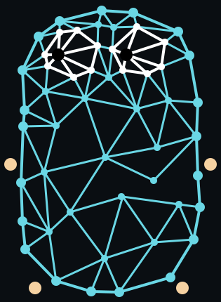

# Gonnect

**Gonnect** is a collection of network helper functions and common types that
have been reinvented and reimplemented countless times in many Go projects.
I created it mostly for myself, but feel free to use it in your projects or 
[suggest features](https://github.com/asciimoth/gonnect/issues/new).

## Related projects

There are some projects based on Gonnect or created for similar use cases. 
You may find them useful too:

- [bufpool](https://github.com/asciimoth/bufpool) – Byte buffer pool interface and testing helpers
- [putback](https://github.com/asciimoth/putback) – A minimal library that provides wrappers for common I/O interfaces, adding the ability to return read bytes back to the stream for subsequent reading
- [socksgo](https://github.com/asciimoth/socksgo) – The most complete, compatible, feature-rich, and extensible SOCKS library for Go

## License
Files in this repository are distributed under the CC0 license.  

  
   
  To the extent possible under law,
  <a rel="dct:publisher"
     href="https://github.com/asciimoth">
    ASCIIMoth</a>
  has waived all copyright and related or neighboring rights to
  gonnect.

