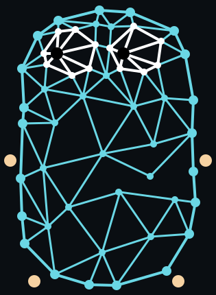

# Gonnect

**Gonnect** is a collection of network helper functions and common types that
have been reinvented and reimplemented countless times in many Go projects.
I created it mostly for myself, but feel free to use it in your projects or 
[suggest features](https://github.com/asciimoth/gonnect/issues/new).

## Routing rules

The `routing` subpackage provides bytecode based routing rules for
`gonnect.Router`, `gonnect/tun.Splitter`, and `gonnect/sniffer.Sniffer`.
Rules can be built directly from bytecode or parsed from a small text format.
See [`routing/README.md`](routing/README.md) for examples.

## Mesh DNS names

The `dns/meshnames` subpackage provides a `gonnect.Resolver` implementation
for mesh-oriented DNS names (`.meshname`, `.meship`, `.ygg`, and `.pk.ygg`).
See [`dns/meshnames/README.md`](dns/meshnames/README.md) for examples.

## Related projects

There are some projects based on Gonnect or created for using with it. 
You may find them useful too:

- [gonnect-netstack](https://github.com/asciimoth/gonnect-netstack) - gVisor's netstack integration for the gonnect ecosystem 
- [gonnect-vpn-example](https://github.com/asciimoth/gonnect-vpn-example) - An example of simple point-to-point VPN built on top of the gonnect ecosystem 
- [tuntap](https://github.com/asciimoth/tuntap) - Cross-platform TUN device library extracted from wireguard-go 
- [ygg](https://github.com/asciimoth/ygg) - alternative yggdrasil mesh network implementation with [WASM builds supported](https://asciimoth.github.io/ygg/)
- [wgo](https://github.com/asciimoth/wgo) - [WireGuard](https://www.wireguard.com/) library based on gonnect-netstack, tuntap, batchudp with [amnesia obfuscation](https://github.com/amnezia-vpn/amneziawg-go) support
- [wg-web-demo](https://github.com/asciimoth/wg-web-demo) - browser WASM demonstration of HTTP over WireGuard over socks-over-websocket using userspace TCP/IP stack 
- [socksgo](https://github.com/asciimoth/socksgo) - The most complete, compatible, feature-rich, and extensible SOCKS library for Go
- [batchudp](https://github.com/asciimoth/batchudp) - UDP transport package extracted from wireguard-go/conn
- [bufpool](https://github.com/asciimoth/bufpool) - Byte buffer pool interface and testing helpers
- [putback](https://github.com/asciimoth/putback) - A minimal library that provides wrappers for common I/O interfaces, adding the ability to return read bytes back to the stream for subsequent reading
- [sysnet-debug](https://github.com/asciimoth/sysnet-debug) - debug implementation of OS network abstraction from `gonnect/sysnet`
- [pmark](https://github.com/asciimoth/p-mark) - Go lib and tool for tagging processes for split routing and other purposes

## License
Files in this repository are distributed under the CC0 license.  

  
   
  To the extent possible under law,
  <a rel="dct:publisher"
     href="https://github.com/asciimoth">
    ASCIIMoth</a>
  has waived all copyright and related or neighboring rights to
  gonnect.

